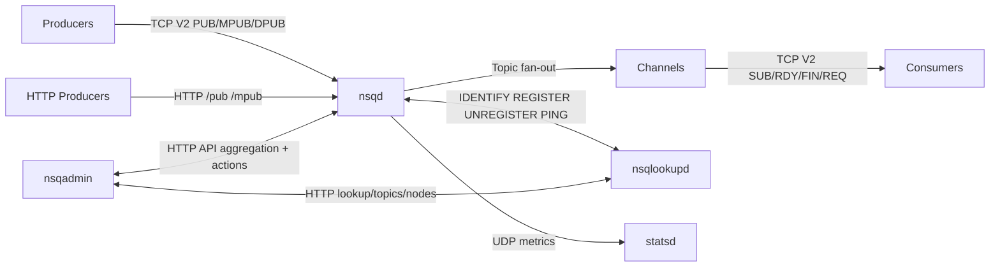
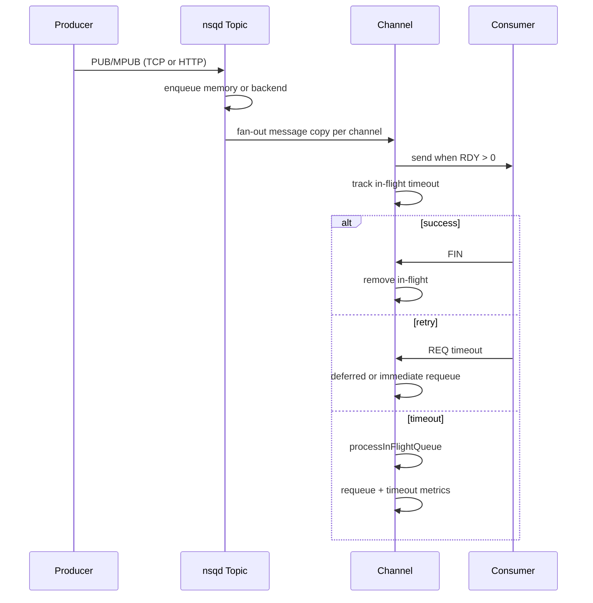

# NSQ Architecture Analysis (Code-Grounded)

## 1. Scope and Reading Strategy

This document analyzes the architecture implemented in this repository by tracing runtime flow and boundaries across:

- Core broker data-plane: [nsqd/nsqd.go](nsqd/nsqd.go), [nsqd/topic.go](nsqd/topic.go), [nsqd/channel.go](nsqd/channel.go), [nsqd/protocol_v2.go](nsqd/protocol_v2.go), [nsqd/http.go](nsqd/http.go)
- Discovery/control registry: [nsqlookupd/nsqlookupd.go](nsqlookupd/nsqlookupd.go), [nsqlookupd/lookup_protocol_v1.go](nsqlookupd/lookup_protocol_v1.go), [nsqlookupd/registration_db.go](nsqlookupd/registration_db.go), [nsqlookupd/http.go](nsqlookupd/http.go)
- Admin/control-plane UI/API: [nsqadmin/nsqadmin.go](nsqadmin/nsqadmin.go), [nsqadmin/http.go](nsqadmin/http.go), [internal/clusterinfo/data.go](internal/clusterinfo/data.go)
- Supporting primitives and cross-cutting modules: [internal/http_api/api_response.go](internal/http_api/api_response.go), [internal/http_api/http_server.go](internal/http_api/http_server.go), [nsqd/statsd.go](nsqd/statsd.go), [nsqd/client_v2.go](nsqd/client_v2.go), [nsqd/tcp.go](nsqd/tcp.go), [nsqd/message.go](nsqd/message.go)

The analysis is intentionally architecture-first, but every claim is tied to concrete code behavior.

## 2. System Topology and Responsibility Split

At a high level NSQ is a set of cooperating daemons, not a monolith:

- nsqd: message broker data-plane node (ingest, queueing, fan-out, delivery semantics)
- nsqlookupd: eventually consistent producer registry/discovery service
- nsqadmin: read/write control-plane and observability facade over nsqd + nsqlookupd
- apps/* tools: utility clients, connectors, and operational helpers

### High-level component view

## 3. Runtime Bootstrap and Process Model

### 3.1 Entrypoints and process lifecycle

Each daemon has a thin app entrypoint under apps/* that:

- builds options from flags + optional TOML config
- validates compatibility constraints
- instantiates daemon object
- starts background main loop via go-svc lifecycle hooks (Start/Stop)

Key entrypoints:

- [apps/nsqd/main.go](apps/nsqd/main.go)
- [apps/nsqlookupd/main.go](apps/nsqlookupd/main.go)
- [apps/nsqadmin/main.go](apps/nsqadmin/main.go)

### 3.2 nsqd startup

nsqd.New in [nsqd/nsqd.go](nsqd/nsqd.go) initializes:

- in-memory maps/channels and option atomics
- data-path lock (single writer per data directory)
- TCP/HTTP/HTTPS listeners
- TLS server/client config (if configured)
- cluster info helper client
- lookup peer storage

nsqd.Main starts coordinated goroutines:

- TCP server loop for V2 protocol
- HTTP and optional HTTPS servers
- queue scan subsystem
- lookup registration/heartbeat loop
- optional statsd push loop

The daemon uses a shared wait group wrapper and a single exit channel to coordinate shutdown.

## 4. Data Model: Topic, Channel, Message

### 4.1 Message shape and encoding

Message core type is in [nsqd/message.go](nsqd/message.go):

- ID: fixed 16 bytes
- Timestamp: int64 nanoseconds
- Attempts: uint16
- Body: opaque bytes

Serialization format written to backend queue:

- 8 bytes timestamp (big endian)
- 2 bytes attempts (big endian)
- 16 bytes message ID
- N bytes body

### 4.2 Topic as fan-out coordinator

Topic implementation in [nsqd/topic.go](nsqd/topic.go):

- owns channel map for subscriptions
- owns memory queue (bounded by MemQueueSize)
- owns backend queue (diskqueue) unless ephemeral
- runs dedicated messagePump goroutine

Topic messagePump behavior:

- waits for Start signal
- reads from memory queue and backend queue
- for each incoming message, replicates per channel (copy-on-fanout for channels after first)
- routes deferred messages through channel deferred path

Design implication:

- fan-out happens inside broker node, not in client library
- per-channel delivery isolation is achieved by per-channel message instances and queue state

### 4.3 Channel as delivery-state machine

Channel implementation in [nsqd/channel.go](nsqd/channel.go):

- owns consumer set (clients)
- owns in-flight map + priority queue (timeout management)
- owns deferred map + priority queue (scheduled delivery)
- owns memory queue and backend queue
- tracks delivery counters and latency stream

Channel is where at-least-once semantics are enforced:

- StartInFlightTimeout when a message is sent to a client
- FinishMessage removes from in-flight and commits successful handling
- RequeueMessage returns message immediately or deferred
- processInFlightQueue times out stuck messages and requeues them
- processDeferredQueue activates due deferred messages

## 5. End-to-End Message Lifecycle

### 5.1 Producer ingress paths

Messages can enter nsqd via:

- TCP V2 commands PUB / MPUB / DPUB in [nsqd/protocol_v2.go](nsqd/protocol_v2.go)
- HTTP /pub and /mpub in [nsqd/http.go](nsqd/http.go)

Validation includes:

- topic/channel naming rules
- body and message size limits
- optional auth checks for TCP path

### 5.2 Queue placement strategy

Topic and Channel both follow hybrid memory+disk behavior:

- try memory channel first for low-latency fast path
- spill to diskqueue backend when memory is full
- ephemeral entities use dummy backend (memory-only semantics)

This yields:

- low-latency under normal load
- bounded memory usage under pressure
- durability for non-ephemeral data via diskqueue

### 5.3 Consumer delivery and acknowledgment

Consumer protocol loop (IOLoop + messagePump) in [nsqd/protocol_v2.go](nsqd/protocol_v2.go) with client state in [nsqd/client_v2.go](nsqd/client_v2.go):

- SUB binds client to topic/channel
- RDY applies pull-credit backpressure
- broker sends framed message and marks in-flight
- FIN acknowledges success
- REQ requeues (immediate or delayed)
- heartbeat and buffered writes manage connection liveness and efficiency

Message lifecycle sequence:

## 6. Discovery and Topology Coordination

### 6.1 nsqd -> nsqlookupd registration protocol

nsqd lookup loop in [nsqd/lookup.go](nsqd/lookup.go) maintains long-lived lookup peers and:

- IDENTIFY with node metadata (addresses, ports, topology tags)
- REGISTER / UNREGISTER on topic and channel changes
- periodic PING heartbeats
- dynamic peer list updates when config changes

### 6.2 nsqlookupd registry model

nsqlookupd uses an in-memory registration DB in [nsqlookupd/registration_db.go](nsqlookupd/registration_db.go):

- key: (category, key, subkey)
- value: producer map
- categories include client, topic, channel

Protocol handling in [nsqlookupd/lookup_protocol_v1.go](nsqlookupd/lookup_protocol_v1.go):

- TCP commands PING, IDENTIFY, REGISTER, UNREGISTER
- automatic cleanup of producer registrations on disconnect
- tombstone semantics to temporarily suppress specific producers

HTTP read-model in [nsqlookupd/http.go](nsqlookupd/http.go):

- /lookup returns producers + channels for topic
- /topics, /channels, /nodes expose discovery views

Architectural property:

- lookup state is soft-state and eventually consistent
- producer liveness is inferred from heartbeat recency

## 7. Control Plane: nsqadmin as Aggregator + Action Gateway

nsqadmin in [nsqadmin/http.go](nsqadmin/http.go) combines three roles:

- static SPA delivery
- API aggregation over nsqd/nsqlookupd
- administrative mutation endpoints (create/delete/pause/tombstone/config)

It delegates multi-node data gathering to clusterinfo in [internal/clusterinfo/data.go](internal/clusterinfo/data.go), which:

- queries lookupd/nsqd in parallel
- merges and deduplicates producer/topic/channel views
- returns partial errors when only subset of upstreams fail

Architectural impact:

- nsqadmin is a control-plane facade, not a source of truth
- observability can degrade partially while preserving some visibility

## 8. Reliability, Durability, and Failure Semantics

### 8.1 Persistence layers

Durability is split:

- metadata durability: topic/channel state in nsqd.dat via LoadMetadata/PersistMetadata in [nsqd/nsqd.go](nsqd/nsqd.go)
- message durability: diskqueue backend per topic/channel in [nsqd/topic.go](nsqd/topic.go) and [nsqd/channel.go](nsqd/channel.go)

Shutdown behavior:

- listeners close first
- metadata persisted
- topics/channels closed and buffers flushed to backend
- background subsystems drained via wait group

### 8.2 Delivery semantics

The implementation is explicitly at-least-once:

- broker may redeliver on consumer failure, timeout, or requeue
- attempts counter increments on each delivery send
- consumers must be idempotent for exactly-once business semantics

### 8.3 Backpressure and overload control

Controls include:

- per-client RDY credit window
- bounded in-memory queues
- spillover to diskqueue
- configurable limits (message/body size, max consumers, timeout bounds)

This avoids unbounded memory growth and lets slow consumers self-throttle via protocol flow control.

## 9. Concurrency Architecture

Key concurrency patterns across the codebase:

- map/state protection with RWMutex for topic/channel/client registries
- atomic counters for hot-path stats and client state
- goroutine-per-subsystem model with explicit exit channels
- lock-minimizing snapshots before I/O (build command list under lock, send outside lock)

Important loops:

- topic.messagePump per topic
- protocolV2.messagePump per subscribed client
- queueScanLoop with worker pool for deferred/in-flight expiration
- lookupLoop for registration heartbeats
- statsdLoop for periodic metrics export

### Queue scan design note

queueScanLoop in [nsqd/nsqd.go](nsqd/nsqd.go) applies a probabilistic dirty-check algorithm inspired by Redis expiration:

- sample a random subset of channels periodically
- process in-flight/deferred queues concurrently via worker pool
- if dirty ratio exceeds threshold, immediately continue scanning

This design balances CPU cost with expiration responsiveness at large channel counts.

## 10. Protocol and API Surfaces

### 10.1 nsqd TCP protocol (V2)

Negotiation and framing in [nsqd/tcp.go](nsqd/tcp.go) and [nsqd/protocol_v2.go](nsqd/protocol_v2.go):

- 4-byte protocol magic selects implementation (currently "  V2")
- framed responses with response/error/message frame types
- command grammar for pub/sub and connection control

Feature negotiation supports:

- TLS upgrade
- snappy or deflate compression
- heartbeat/output buffer tuning
- optional auth workflow (AUTH + authorization checks)

### 10.2 HTTP APIs

nsqd and nsqlookupd expose operational HTTP endpoints for:

- liveness and node info
- publish APIs
- stats and topology introspection
- topic/channel lifecycle operations
- debug/pprof endpoints

Shared response/decorator conventions are implemented in [internal/http_api/api_response.go](internal/http_api/api_response.go).

## 11. Security Model

Primary controls in current architecture:

- optional TLS for nsqd client connections
- optional auth service integration on nsqd TCP path
- TLS options for nsqadmin upstream HTTP client
- admin user gating in nsqadmin for privileged actions

Security caveats to account for in deployment:

- nsqlookupd TCP/HTTP are typically trusted-network interfaces
- without network segmentation and TLS termination, control endpoints are powerful

## 12. Observability and Operations

Observability planes:

- pull: HTTP /stats, /nodes, /topics, /lookup endpoints
- push: statsdLoop UDP metrics in [nsqd/statsd.go](nsqd/statsd.go)
- profiling: pprof endpoints in nsqd/nsqlookupd
- UI/API: nsqadmin aggregated cluster views and actions

The clusterinfo aggregator intentionally supports partial-failure reporting, which is useful in degraded network conditions.

## 13. Extensibility and Ecosystem Utilities

Utility apps under apps/* provide integration patterns:

- nsq_to_http: consume NSQ and invoke HTTP endpoints (fan-out bridge)
- nsq_to_nsq: consume and republish to NSQ clusters (pipeline relay)
- nsq_to_file: sink messages to files
- nsq_tail / nsq_stat: inspection and debugging tools

Representative flow is visible in [apps/nsq_to_http/nsq_to_http.go](apps/nsq_to_http/nsq_to_http.go).

## 14. Architectural Trade-offs (What the Code Optimizes For)

Observed trade-offs in this implementation:

- Simplicity over strong consistency: lookupd uses soft-state in-memory registry and heartbeat-based liveness.
- Throughput + latency balance: memory fast path with disk spillover, buffered protocol writes, and compression options.
- Operational transparency: rich HTTP and pprof endpoints plus statsd export.
- Failure isolation: topic/channel/client state machines confine many failures locally, but delivery remains at-least-once.

## 15. Practical Scaling Guidance From the Current Design

Based on implementation behavior:

- Scale writers/readers horizontally across nsqd nodes; do not treat a single nsqd as global ordering authority.
- Tune MemQueueSize, SyncEvery, SyncTimeout to balance latency vs disk pressure.
- Keep consumer handlers idempotent and monitor timeout/requeue counters.
- Use multiple nsqlookupd for discovery resilience and avoid relying on one registry node.
- Size queue scan parameters carefully for high channel cardinality to keep timeout/deferred latency acceptable.

## 16. Summary

NSQ in this repository is architected as a decoupled, pragmatic messaging platform:

- nsqd owns the hard data-plane work (ingest, queueing, fan-out, retries, persistence)
- nsqlookupd provides lightweight, eventually consistent service discovery
- nsqadmin composes cluster state and mutation APIs into an operator-facing control plane

The code demonstrates a deliberate emphasis on operational simplicity, high-throughput asynchronous messaging, and fault-tolerant at-least-once delivery rather than strict global coordination.
